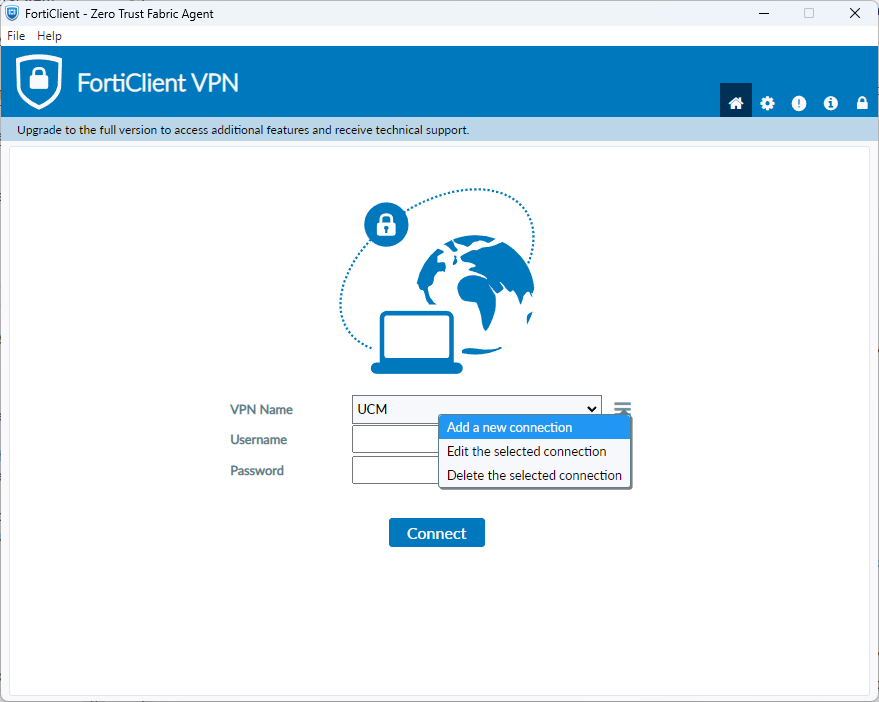
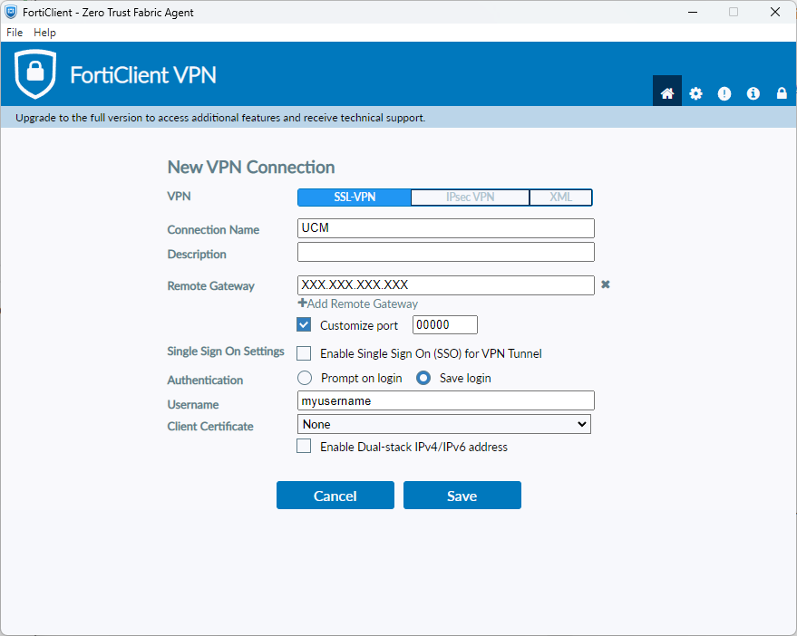

This page provides guidelines and instructions for accessing the LBQC server remotely using SSH and VPN for secure access.
It covers SSH access setup, SSH customization, passwordless authentication, and VPN setup for secure communication.

## Accessing via SSH

SSH (Secure Shell) is a cryptographic network protocol used for securely accessing and managing servers remotely.

First, you need to install SSH:

- For Linux and macOS, OpenSSH client is usually pre-installed.
  Otherwise, install it via a package manager such as apt (Ubuntu-based), rpm (Red Hat), packman (Arch Linux), homebrew (macOS), etc.
- For Windows, you can use [PuTTY](https://www.putty.org/) or the built-in Windows Subsystem for Linux (WSL).

To establish an SSH connection, open a terminal and run the following command:

```console
$ ssh <username>@<ipaddr>
```

Replace `<username>` with your login name and `<ipaddr>` with the server's IP address or hostname (see below).
You will be then prompted to enter your password.
To avoid typing your password, see [below]({}).


Both the login name and password will be sent to you when granted access to the LBQC server.
See the [Accounts page]({}) for details.


The IP address is a numerical label in the format `XXX.XXX.XXX.XXX` that identifies a device connected to a computer network.
The IP address of the LBQC server is **{}**.
To avoid typing the IP address, see the [host aliases]({}) section.

## SSH Configuration

SSH allows you to configure a variety of options for better performance, security, and usability.
Defining SSH settings can streamline your workflow by eliminating the need to specify common parameters every time you connect to a server.

These settings are defined in the `~/.ssh/config` file on your local machine.
An example configuration file is as follows:

```bash
Host myserver
    HostName server_ip_or_domain
    User myusername
    Port 22
    IdentityFile ~/.ssh/my_private_key
    Compression yes
```

The fields shown in the example of a host entry are:

- `Host`: A short alias for the server to use in commands, that is, you will be able to use `ssh myserver` instead of `ssh <ipaddr>` in the terminal.
- `HostName`: The actual IP address or domain name of the server.
- `User`: The SSH username. Defaults to the local user.
- `Port`: The SSH port (default is 22).
- `IdentityFile`: Path to the private SSH key for authentication. This allows for passwordless connection (see [Passwordless authentication]({}) section below). Defaults to the identity file named `id_rsa` if exists.
- `Compression`: Enable compression for faster file transfers.

You can have as many host entries as you want, each defining a different number of options as necessary.
For instance, a server may require a different port, the server's username is different from your local user, etc.

You can define default settings that will apply to all SSH sessions without needing to specify them each time you connect using the `*` wildcard in the host entry:

```bash
# Default SSH settings for all hosts
Host *
    User myusername
    Port 22
    IdentityFile ~/.ssh/id_rsa
    Compression yes

# Specific settings for 'myserver' host
Host myserver
    HostName 10.1.1.55
    Port 2222
```

Here both the IP address and port are overridden for `myserver`, but otherwise it uses the default values.

Some recommended options are discussed below.

### Host aliases

As stated above, you can define aliases for connecting to different servers to avoid typing the IP address every time.
You can set up host aliases in the SSH configuration as shown above, but they will only be available to SSH.

Alternatively, you can define host aliases OS-wide in the Hosts file.
It is commonly used to override DNS (Domain Name System) lookups, enabling you to define custom mappings or make local aliases for frequently used servers.

The Hosts file can be found at:

- **Linux/macOS**: The hosts file is located at `/etc/hosts`.
- **Windows**: The hosts file is located at `C:\Windows\System32\drivers\etc\hosts`.


You will need administrative or root privileges to edit the hosts file.


The general format is:

```text
<ipaddr> <hostname> [<alias> ...]
```

- `<ipaddr>`: The IP address of the host.
- `<hostname>`: The fully qualified domain name (FQDN) of the host (e.g., `myserver.local`).
- `<alias>`: Optional aliases for the hostname, separated by spaces (e.g., `myserver`).

An example of a Hosts file is as follows:

```bash
127.0.0.1       localhost
127.0.1.1       mylocalmachine

# Custom server mapping
192.168.1.10    myserver.example.com  myserver
192.168.1.20    backup.example.com    backup

# External websites (useful for overriding DNS or for quick testing)
93.184.216.34   example.com           # Overriding DNS for example.com
```

Each line in the hosts file maps an IP address to a hostname:

- `127.0.0.1 localhost`: This line maps the loopback address 127.0.0.1 to localhost.
  This is a standard entry in the hosts file.
- `127.0.1.1 mylocalmachine`: This line is commonly used to map a local machine name (`mylocalmachine`) to the IP address 127.0.1.1 (a variation of the localhost address).
- `192.168.1.10 myserver.example.com myserver`: This maps the IP address 192.168.1.10 to `myserver.example.com` and creates an alias `myserver`.
  When you run `ssh myserver`, it will connect to 192.168.1.10.
- `93.184.216.34 example.com`: In this example, the IP address for `example.com` is overridden.
  If you use `example.com` in your browser or on a command line tool, it will resolve to 93.184.216.34 instead of the address specified by DNS.

### Session timeout

To prevent SSH sessions from timing out due to inactivity, you can modify the host settings as follows:

```bash
Host myserver
    ...
    ServerAliveInterval 60
    ServerAliveCountMax 3

# or

Host *
    ServerAliveInterval 60
    ServerAliveCountMax 3
```

The client will send a "keep alive" message (faking activity) every 60 seconds to the server to avoid disconnection, but if the client does not get a response after 3 attempts, it will disconnect.

### Passwordless authentication {#passwordless}

You can avoid typing your password every time you initiate an SSH session by setting up passwordless SSH access.
This alternative method uses SSH key pairs from authentication.

Follow these steps in a terminal:

1. Generate an SSH key pair (if you don’t have one already):

   ```console
   $ ssh-keygen -t rsa -f ~/.ssh/id_rsa
   ```

   Just press Enter for every prompt, including default file location and optional passphrase.

2. Copy the public key to the server:

   ```console
   $ ssh-copy-id <username>@<ipaddr>
   ```

   You will be prompted to enter the password for the remote server. Afterward, the public key will be added to the `~/.ssh/authorized_keys` file on the server.

3. Verify passwordless login:

   ```console
   $ ssh <username>@<ipaddr>
   ```

   You should now be able to log in without entering a password.

## Remote access {#remote}

To connect to the LBQC server, you need to access to the virtual private network (VPN) of the institution.
It uses the FortiGate VPN service, which can be accessed via the FortiClient software.

The FortiClient application can be obtained from the FortiNet's [product downloads](https://fortinet.com/support/product-downloads) page.
Direct links are the following:

- For Windows: [enter here](https://links.fortinet.com/forticlient/win/vpnagent).
- For macOS: [enter here](https://links.fortinet.com/forticlient/mac/vpnagent).
- For Linux:
  - Ubuntu-based: [enter here](https://links.fortinet.com/forticlient/deb/vpnagent).
  - RHEL-based: [enter here](https://links.fortinet.com/forticlient/rhel/vpnagent).

Then, follow the installation instructions specific to your operating system.

Once you open the FortiClient app, you then need to create a new VPN connection as follows:




Enter the following VPN settings, leave the rest as shown in the image:

- **Remote Gateway**: The server's public IP or VPN hostname.
- **Port**: Default SSL VPN port is 443.
- **Username**: Enter your username for the VPN (may not be the same as the LBQC user login).


These settings will be sent to you when granted access to the LBQC server along the user login and password.
See the [Accounts page]({}) for details.


After entering the details, click on "Save" and then "Connect".
FortiClient will attempt to establish a secure tunnel to the server.
If successful, you can now access the server securely.
